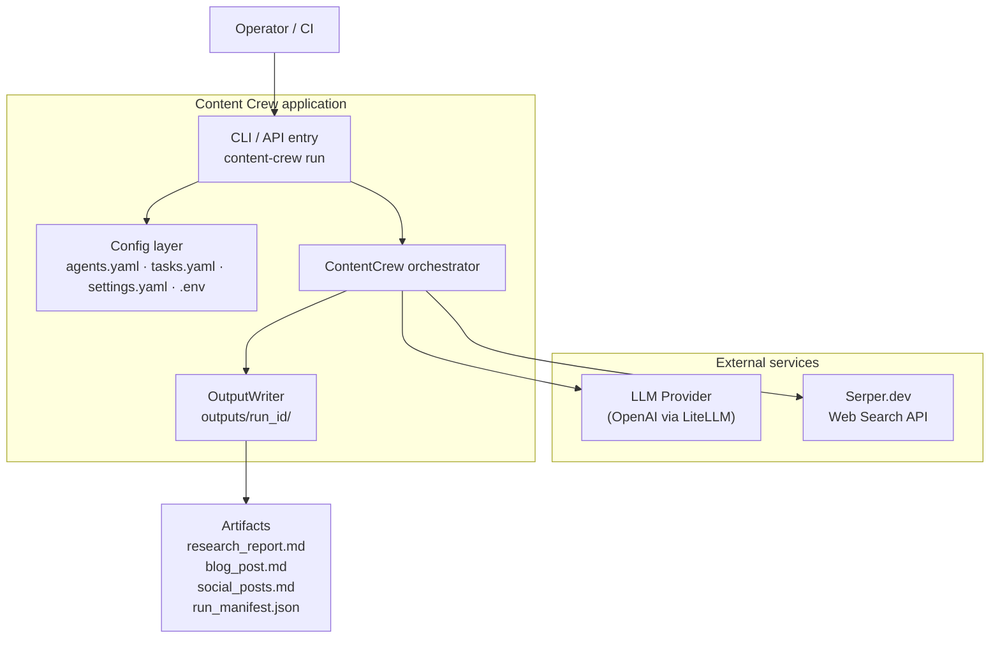
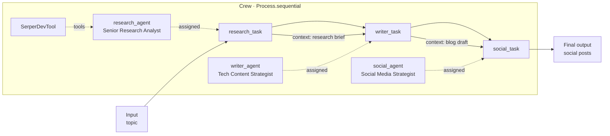
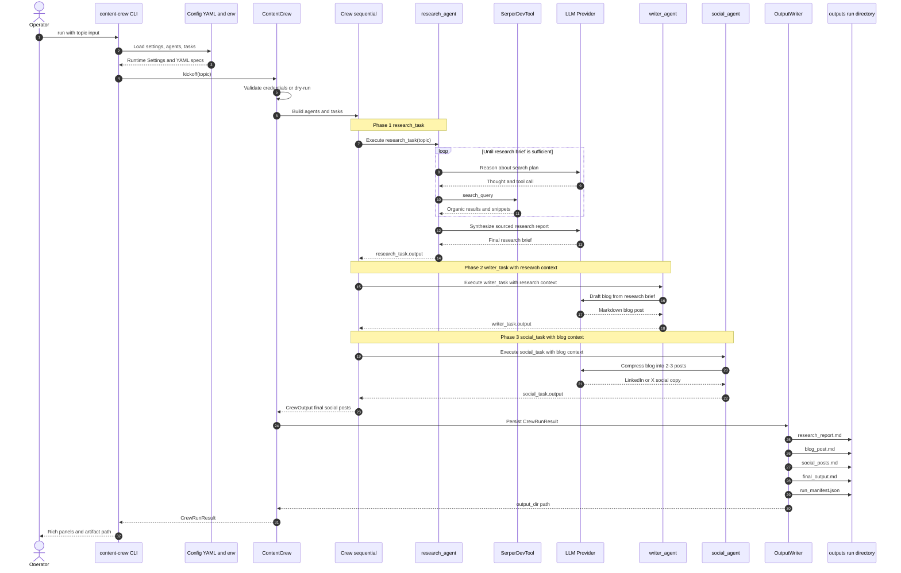
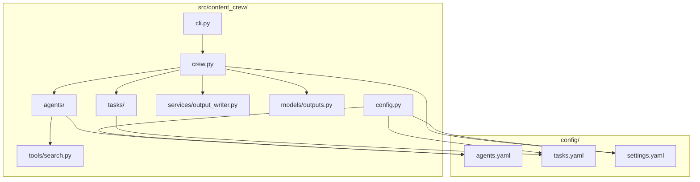
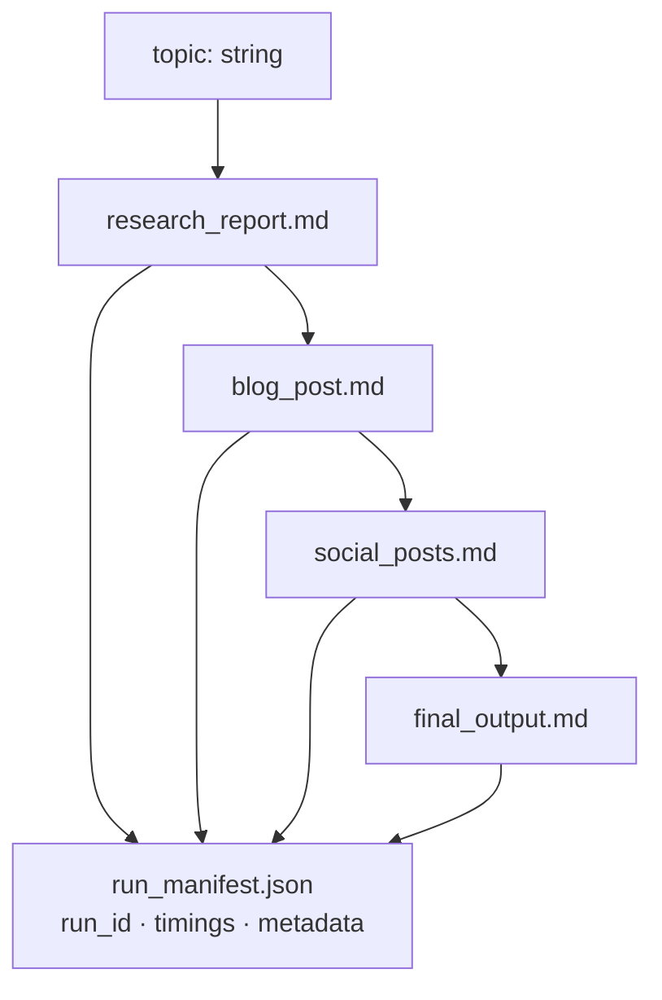

# Multi-Agents on CrewAI

Production-oriented **multi-agent content pipeline** built with [CrewAI](https://www.crewai.com/). Three specialized agents collaborate in a **sequential process** to turn a topic into researched insight, a publishable blog post, and platform-ready social copy.

| Agent | Role | Responsibility |
| --- | --- | --- |
| `research_agent` | Senior Research Analyst | Web research + structured briefing with sources |
| `writer_agent` | Tech Content Strategist | Research → engaging tech blog post |
| `social_agent` | Social Media Strategist | Blog → 2–3 LinkedIn / X posts |

---

## Learning objectives

After working through this project you will be able to:

- Leverage CrewAI to automate multi-agent workflows for intelligent content generation.
- Understand CrewAI’s core building blocks — **agents**, **tasks**, **tools**, and **processes** — and how they compose into a sequential pipeline.
- Implement a real collaboration pattern: technical research → reader-friendly content → social distribution.
- Extend the same pattern to marketing, education, and research-automation domains.

---

## Architecture

### System context



### Sequential multi-agent pipeline



### Sequence diagram — end-to-end collaboration

How a single `content-crew run --topic "..."` call flows through the sequential CrewAI pipeline: research with Serper, writing with research context, social cutdown with blog context, then artifact persistence.



### Component map (repository)



### Data / artifact flow



---

## Project structure

```text
Multi-Agents-on-CrewAI/
├── config/
│   ├── agents.yaml          # Roles, goals, backstories
│   ├── tasks.yaml           # Descriptions, expected outputs, context chain
│   └── settings.yaml        # Crew / LLM / output defaults
├── src/content_crew/
│   ├── cli.py               # Typer CLI (run, doctor, version)
│   ├── crew.py              # ContentCrew orchestrator
│   ├── config.py            # Pydantic settings + YAML loaders
│   ├── agents/              # Agent factory
│   ├── tasks/               # Task factory + context wiring
│   ├── tools/               # Serper search tool wiring
│   ├── services/            # Artifact persistence
│   └── models/              # Run result schemas
├── outputs/                 # Per-run artifacts (gitignored contents)
├── tests/                   # Unit tests + dry-run pipeline tests
├── docs/architecture.md     # Extended design notes
├── .env.example
├── pyproject.toml
├── requirements.txt
└── Makefile
```

This layout separates **declarative config** (who the agents are / what they do) from **imperative orchestration** (how the crew is built and executed), which is the usual pattern for systems you expect to evolve beyond a notebook demo.

---

## CrewAI building blocks (how they map here)

| Concept | In this project | Notes |
| --- | --- | --- |
| **Agent** | `config/agents.yaml` → `agents/` | Role, goal, backstory; research agent owns search tools |
| **Task** | `config/tasks.yaml` → `tasks/` | Description + expected output; writer/social receive prior context |
| **Tool** | `tools/search.py` → `SerperDevTool` | Live web search for the research agent |
| **Process** | `Process.sequential` | Strict order: research → write → social |
| **Crew** | `ContentCrew` in `crew.py` | Assembles agents/tasks and calls `kickoff(inputs={"topic": …})` |

---

## Setup

### Prerequisites

- Python **3.10–3.12**
- An OpenAI API key (or compatible key routed through LiteLLM)
- A [Serper](https://serper.dev) API key for live web research (optional for `--dry-run`)

### Install

```bash
cd Multi-Agents-on-CrewAI
python -m venv .venv
source .venv/bin/activate          # Windows: .venv\Scripts\activate
pip install -U pip
pip install -e ".[dev]"
cp .env.example .env               # then edit API keys
```

Pinned stack (aligned with the lab versions you shared):

| Package | Version |
| --- | --- |
| `crewai` | `0.80.0` |
| `crewai-tools` | `0.38.0` |
| `langchain` | `0.3.20` |
| `langchain-community` | `0.3.19` |

> **Note:** Installing `crewai` and `crewai-tools` together can pull transitive upgrades. Prefer `pip install -e ".[dev]"` from this repo so pins in `pyproject.toml` / `requirements.txt` stay authoritative. Restart your shell/kernel after install if packages were upgraded in-place.

---

## Usage

### Validate environment

```bash
content-crew doctor
```

### Live run

```bash
content-crew run --topic "Latest Generative AI breakthroughs"
# or
make run TOPIC="Latest Generative AI breakthroughs"
```

### Dry run (no LLM / Serper calls — CI & local smoke tests)

```bash
content-crew run --topic "Latest Generative AI breakthroughs" --dry-run
# or
make dry-run
```

### Programmatic API

```python
from content_crew.crew import run_pipeline

result = run_pipeline("Latest Generative AI breakthroughs")
print(result.final_output)
print(result.metadata["output_dir"])
```

Equivalent CrewAI core (what the orchestrator builds):

```python
crew = Crew(
    agents=[research_agent, writer_agent, social_agent],
    tasks=[research_task, writer_task, social_task],
    process=Process.sequential,
    verbose=True,
)
result = crew.kickoff(inputs={"topic": "Latest Generative AI breakthroughs"})
```

---

## Outputs

Each run writes a directory under `outputs/`:

```text
outputs/<run_id>_<topic-slug>/
├── research_report.md
├── blog_post.md
├── social_posts.md
├── final_output.md
└── run_manifest.json
```

`run_manifest.json` includes `run_id`, timestamps, topic, dry-run flag, and per-task artifacts for auditing or downstream publishing jobs.

---

## Testing & quality

```bash
make test        # pytest (includes dry-run pipeline)
make lint        # ruff
make typecheck   # mypy
```

Live LLM integration tests are intentionally out of scope for the default suite so CI stays deterministic and free.

---

## Extending the system

Practical next steps that keep the architecture intact:

1. **New domain** — duplicate agent/task YAML entries (e.g. `educator_agent`) and append a task to the sequential chain.
2. **Hierarchical process** — switch `process` in `settings.yaml` / `crew.py` to `Process.hierarchical` and designate a manager agent.
3. **More tools** — add file I/O, scrapers, or vector retrieval beside Serper in `tools/`.
4. **Publishing adapters** — consume `outputs/*/run_manifest.json` from a CMS, Slack, or scheduling worker.
5. **Observability** — hook OpenTelemetry exporters already pulled in by CrewAI for production traces.

See [docs/architecture.md](docs/architecture.md) for deeper design rationale and Mermaid views of extension points.

---

## License

MIT
