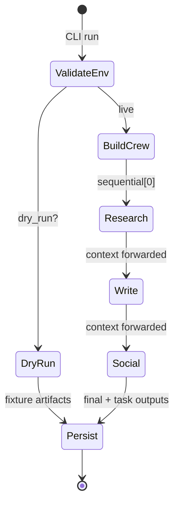
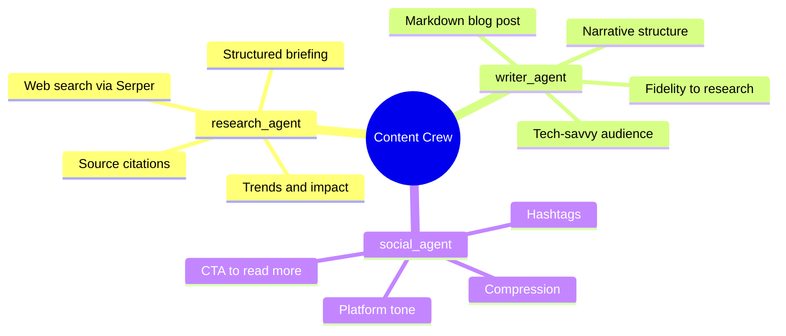
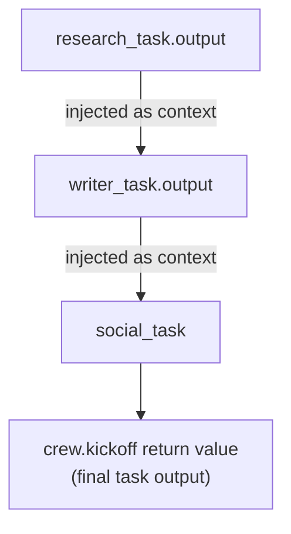
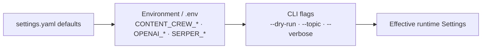
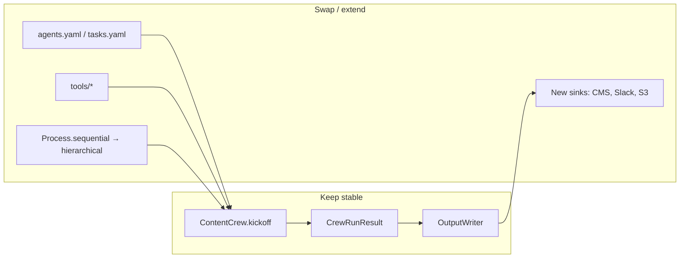

# Architecture

This document expands on the README diagrams and explains design choices for a production-shaped CrewAI content pipeline.

## Design goals

1. **Declarative agents/tasks** — role text lives in YAML so product/content owners can iterate without touching Python.
2. **Thin orchestration** — `ContentCrew` only wires factories, validates credentials, runs `kickoff`, and persists artifacts.
3. **Deterministic CI** — `--dry-run` / `CONTENT_CREW_DRY_RUN=true` exercises the full path without billed LLM or Serper calls.
4. **Auditable outputs** — every run produces Markdown artifacts plus a JSON manifest.

## Control flow

## Agent responsibilities

## Context passing

CrewAI tasks declare `context=[prior_task]` so the writer and social agents receive prior raw outputs rather than re-deriving them. That mirrors how a human editorial desk hands a brief → draft → social cutdown.

## Configuration precedence

## Failure modes & mitigations

| Failure | Behavior |
| --- | --- |
| Missing `OPENAI_API_KEY` on live run | `RuntimeError` before `kickoff` |
| Missing `SERPER_API_KEY` | Warning; research agent runs with empty tool list |
| Tool init failure | Soft-fail; crew still builds |
| Downstream publisher outage | Irrelevant to core crew — artifacts remain on disk |

## Extension points

## Why not a single notebook?

Notebooks are excellent for exploration. This layout is aimed at:

- reproducible installs (`pyproject.toml` / pins),
- a real CLI for operators,
- unit-testable factories and persistence,
- clear seams for adding agents without rewriting the demo cell.
